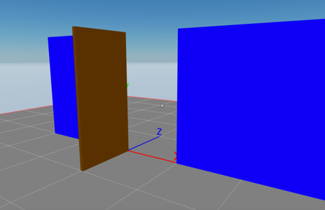

# Block Dog

A scene that uses a server and a REST API to sync a scene state amongst multiple users. It’s built around the basic “open the door” example.

- Create a REST server
- Call REST API



<!--
[Explore the scene](): this link takes you to a copy of the scene deployed to a remote server where you can interact with it just as if you were running `dcl start` locally.
-->

**Install the CLI**

Download and install the Decentraland CLI by running the following command

```bash
npm i -g decentraland
```

For a more details, follow the steps in the [Installation guide](https://docs.decentraland.org/documentation/installation-guide/).


**Previewing the scene**

Once you've installed the CLI, download this example and navigate to its directory from your terminal or command prompt.

#### Run the REST server

(In another terminal window)

```sh
# from the project root
cd server

# install node dependencies
npm install

# start the server
npm start
```

#### Run the scene preview

```sh
# from the project root
cd scene

# install node dependencies
npm install

# start the preview
dcl start
```

Open multiple browser tabs by copying the preview URL. Interact with the door on one tab to see that it also changes on other tabs as well.

Any dependencies are installed and then the CLI will open the scene in a new browser tab automatically.

**Usage**

Click on the door to open or close it. Other users should see the door change state as well.

Learn more about how to build your own scenes in our [documentation](https://docs.decentraland.org/) site.


## Copyright info

This scene is protected with a standard Apache 2 licence. See the terms and conditions in the [LICENSE](/LICENSE) file.